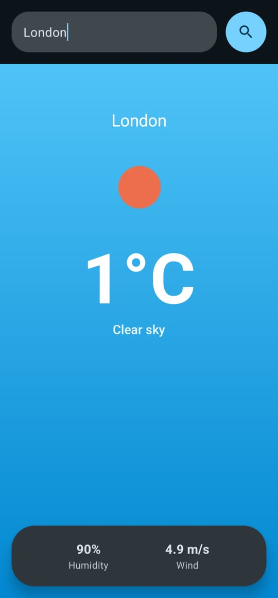
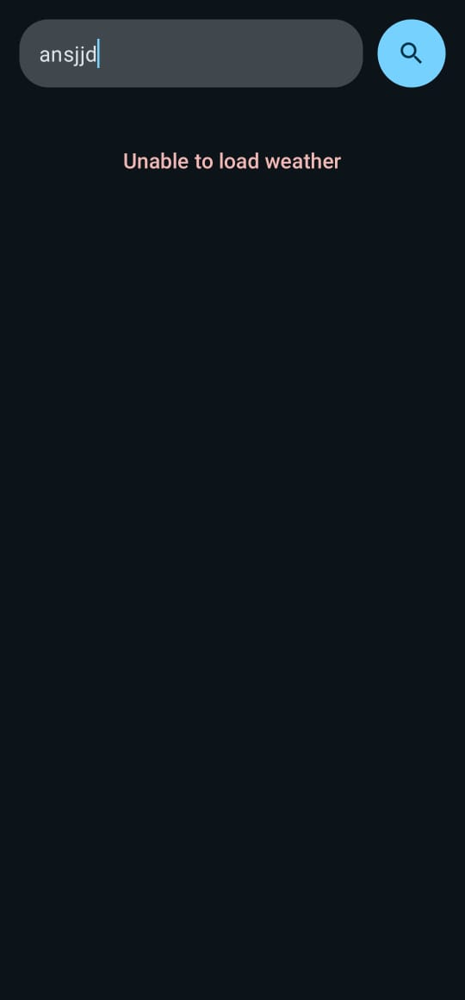

# 🌦️ Weather Info App (Jetpack Compose)

A modern **Weather application built with Kotlin and Jetpack Compose**, following **MVVM architecture**.  
The app allows users to search for a city and view real-time weather information with a clean, aesthetic UI.

---

## ✨ Features

- 🔍 Search weather by city name
- 🌡️ Display temperature, description, humidity, and wind speed
- 🎨 Full-screen modern UI inspired by popular weather apps
- ⏳ Loading & Error states using `sealed interface`
- 🧱 Clean MVVM architecture
- 🌊 Asynchronous image loading with Coil
- 🔄 State management using `StateFlow`

---

## 🧠 Architecture

The project follows **MVVM (Model–View–ViewModel)** with clear separation of concerns:

```

UI (Compose)
↓
ViewModel (StateFlow + UiState)
↓
Repository
↓
Remote API (Retrofit)

````

### Layers
- **UI Layer**: Jetpack Compose screens & UI models
- **ViewModel**: Handles state, business logic, and data mapping
- **Repository**: Single source of truth for data
- **Data Layer**: Retrofit API calls and DTOs

---

## 🛠 Tech Stack

- **Kotlin**
- **Jetpack Compose**
- **Material 3**
- **Retrofit**
- **Coroutines**
- **StateFlow**
- **Coil**
- **OpenWeather API**

---

## 🚀 Getting Started

### 1️⃣ Clone the repository
```bash
git clone https://github.com/your-username/weather-info-app.git
````

---

### 2️⃣ Add your OpenWeather API Key 🔑

This project uses the **OpenWeather API**.

👉 Open the file:

```
data/network/WeatherApi.kt
```

👉 Replace the API key value with your own:

```kotlin
@GET("data/2.5/weather")
suspend fun getWeather(
    @Query("q") city: String,
    @Query("units") units: String = "metric",
    @Query("appid") apiKey: String = "YOUR_OPENWEATHER_API_KEY"
): WeatherResponse
```

🔗 Get your API key from:
[https://openweathermap.org/api](https://openweathermap.org/api)

---

### 3️⃣ Build & Run

* Open the project in **Android Studio**
* Sync Gradle
* Run on an emulator or physical device

---

## 📱 Screenshots (UI Concept)

* Full-screen weather background
* Large bold temperature display
* Bottom card for extra parameters (humidity & wind)
* Clean search bar at the top

<p align="center">



</p>

---

## 📌 Notes

* Temperature is fetched in **Celsius** using `units=metric`
* The app currently initializes the repository inside the ViewModel for simplicity
* Can be easily extended with:

    * Dependency Injection (Hilt)
    * Hourly / daily forecast
    * Weather animations
    * Dark / Light theme switching

---

## 🧪 Future Improvements

* 🔁 Retry button on error state
* 🌈 Weather-based animated backgrounds
* 📍 Location-based weather
* 💉 Hilt for dependency injection
* 🧪 Unit tests for ViewModel

---

## 🏆 Learning Outcome

This project is ideal for:

* Learning **Jetpack Compose**
* Understanding **StateFlow & sealed UI states**
* Practicing **clean MVVM architecture**
* Building a **portfolio-ready Android app**

---

## 📄 License

This project is for learning and personal use.


